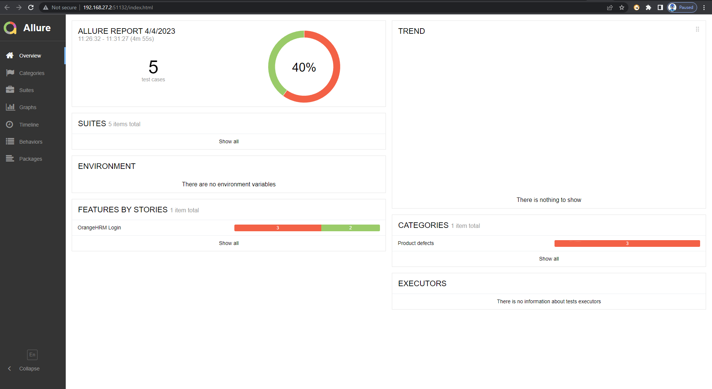

# Automation Testing Basic Framework

### Feature
1. Behavior driven development (BDD)
2. Page object Model
3. Selenium 
4. Allure reporting

### Test run using Google chrome

Uploading screen-capture_compress.mp4…

### Allure report Result testing 

### how to use allure report

#### Install allure-behave

`pip install allure-behave`

#### run allure report

`behave -f allure_behave.formatter:AllureFormatter -o .\reports\ .\features\login.feature`

#### show result

`allure serve %allure_result_folder%`
